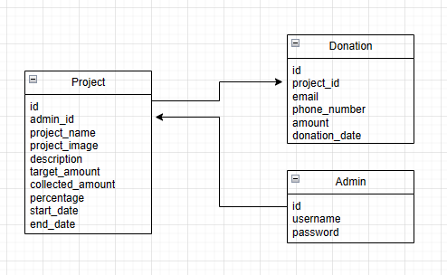

# Introduction

Website LSTR! (Lestari) adalah final Project yang dirancang untuk memenuhi _final assignment_ dari **RevoU** dengan topic **_Climate Change_**.

Project ini menggunakan **SQL** dan **Supabase** sebagai database, bberikut adalah dokumentasi API yang didapatkan dari database tersebut:

1. [API Project](https://groupbprojectbe-production.up.railway.app/project)
2. [Postman Documentation](https://documenter.getpostman.com/view/32144902/2sA3BrWpfa)

| Methods | Endpoint                                                                             |
| ------- | ------------------------------------------------------------------------------------ |
| GET     | `/admin`, `/admin/[admin_id]`, `/admin/logout`, `/project`, `/project/[project_id]`, |
| POST    | `/admin`, `/admin/login`, `/project/create`, `/donation/create`                      |
| PUT     | `/project/update/[project_id]`                                                       |
| DELETE  | `/admin/[admin_id]`, `/project/delete/[project_id]`                                  |

## Block Diagram Database

berikut adalah gambaran bagaimana database dalam project ini bekerja.

### In Project

- Python ver 3.10
- Poetry sebagai library `pip install poetry`
- Flask sebagai framework `poetry install flask`
- FLask_jwt_extended : extension protected route
- bcyript : encrypt password
- pydantic : validation data

### Structure

Connector
: -- SQL_connector

Controller
: -- admin
: -- donation
: -- project

Models
: -- base
: -- admin
: -- donation
: -- project

Routes
: -- admin
: -- donation
: -- project
